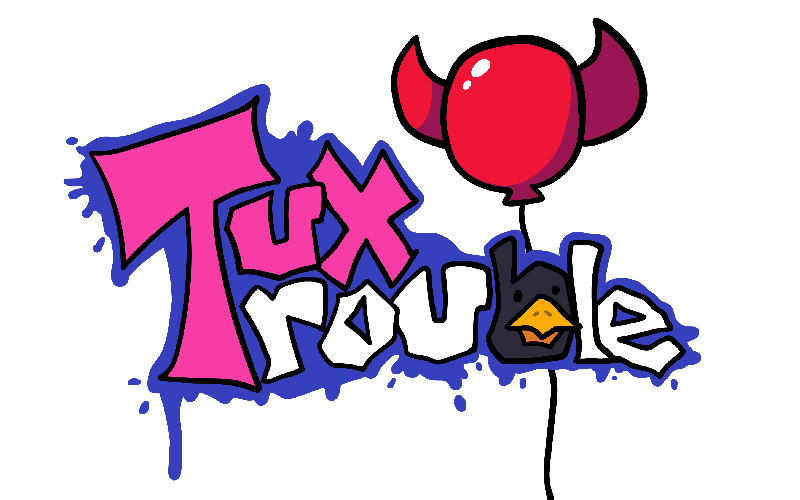

# Friday Night Funkin': Tux Trouble Remastered
## Friday Night Funkin'
**Friday Night Funkin'** is a rhythm game originally made for Ludum Dare 47 "Stuck In a Loop".

Links: **[itch.io page](https://ninja-muffin24.itch.io/funkin) ⋅ [Newgrounds](https://www.newgrounds.com/portal/view/770371) ⋅ [source code on GitHub](https://github.com/ninjamuffin99/Funkin)**
> Uh oh! Your tryin to kiss ur hot girlfriend, but her MEAN and EVIL dad is trying to KILL you! He's an ex-rockstar, the only way to get to his heart? The power of music... 

## Kade Engine 1.5.3
**Kade Engine** is a mod for Friday Night Funkin', including a full engine rework, replays, and more.

Links: **[GameBanana mod page](https://gamebanana.com/gamefiles/16761) ⋅ [play in browser](https://funkin.puyo.xyz) ⋅ [latest stable release](https://github.com/KadeDev/Kade-Engine/releases/latest) ⋅ [latest development build (windows)](https://ci.appveyor.com/project/KadeDev/kade-engine-windows/branch/master/artifacts) ⋅ [latest development build (macOS)](https://ci.appveyor.com/project/KadeDev/kade-engine-macos/branch/master/artifacts) ⋅ [latest development build (linux)](https://ci.appveyor.com/project/KadeDev/kade-engine-linux/branch/master/artifacts)**

**REMEMBER**: This is a **mod**. This is not the vanilla game and should be treated as a **modification**. This is not and probably will never be official, so don't get confused.

## Kade Website ([KadeDev.github.io/kade-engine/](https://KadeDev.github.io/Kade-Engine/))
If you're looking for documentation, changelogs, or guides, you can find those on the Kade Engine website.

# Previews
 - See the gamebanana page for the mod.

# Mod Features

 - **Gallery**
	 - We are proud of this mod and of it's fanart, so we have a in-game gallery (that totally wasn't done a day before the mod came out) that showcases development images and other neat things.
 - **Better-looking Freeplay**
	 - Actually tweens in a way that makes sense instead of awkwardly moving into place from the top. Character portraits instead of health icons. Difficulty locking for songs only charted as hard. Webm previews of the stage.
 - **Cutscenes**
	 - Webm cutscenes between a few story week songs (mp4 did not work full-screen. We saw this as an issue and ditched it before release, thanks cam for catching that by being a fullscreen weirdo.)
 - **Rat Squisher**
	 - Literally the best part of the mod.
 - **Charting**
	 - We have it.
 - **Songs**
	 - 9 (\*10) songs.
	 - 2 full weeks of 4 songs.
	 - 2 (\*3, ambi...) bonus songs. (One of which was previously scrapped from beta and features assets from the mod's beta)
	 - Duet versions of main week songs.
 - **New Stages**
	 - Pretty much every song is on it's own stage (some stages are slight variations on others though).
 - **Unlockables**
	 - They're a secret, but just know that they aren't that major besides one and that there are a total of 3 unlockables that arent trophies.
	 - You can get trophies simply by playing the mod. At least one should be fairy obvious as to what it is and how to get it.
 - **Update-nag**
	 - We hijaked kade's update nag code instead of disabling it. On the unlikely chance we DO release any more updates, the mod will let you know. We've already used this to notify people with early builds of the release patch that fixed some issues they found in testing.

# Engine Features

 - **Dialouge that does not replay every time you die or restart**
	 - You do, however, have the option to re-read the dialouge in the pause menu.
 - **Replays can be deleted from the in-game menu** (only tested on windows)
	 - Kade :trollface:
	 - the shift button does it, I didn't exactly have time to find a more intuitive way with more important stuff about the mod at hand.
 - **Audio offset in pause menu fixed**
	 - You are now required to hold shift to change the per-song offset from the pause menu. No more annoying bullshit there.
 - **Toggle-able Discord Prescense**
	 - Discord RPC can be toggled from the Misc options category without needing to mess with your Discord settings!
 - **Bad Input System**
	 - A shitty KE 1.5.3 input system that people started complaining about literally two weeks before the mod came out so there was no time to downgrade to 1.4.2 or port up the 1.4.2 input. It probably wont get an offcial fix unless the extremely unlikely conditon is met that we want to do another content update. (but to be fair, have you guys even tried messing with the settings to fix this? Im a shitty programmer, not a rythym game enthusiast or fnf fan, but there has to be a setting in KE 1.5.3 that at least makes the input drop bearable?) Mod is good anyway.

# Credits
### Friday Night Funkin'
 - [ninjamuffin99](https://twitter.com/ninja_muffin99) - Programming
 - [PhantomArcade3K](https://twitter.com/phantomarcade3k) and [Evilsk8r](https://twitter.com/evilsk8r) - Art
 - [Kawai Sprite](https://twitter.com/kawaisprite) - Music

This game was made with love to Newgrounds and its community. Extra love to Tom Fulp.
### Kade Engine
- [KadeDeveloper](https://twitter.com/KadeDeveloper) - Maintainer and lead programmer
- [The contributors](https://github.com/KadeDev/Kade-Engine/graphs/contributors)

### Other Credits can be found below I'm too lazy to credit everyone here in text
- [Credits Cutscene](https://github.com/wewmuu/TuxTrouble/blob/main/assets/preload/videos/credits.webm?raw=true)

### Shoutouts
- [GWebDev](https://github.com/GrowtopiaFli) - Video Code
- [Rozebud](https://github.com/ThatRozebudDude) - Ideas (that Kade stole)
- [Puyo](https://github.com/daniel11420) - Setting up kade appveyor (which we aren't using for tux trouble) and a lot of other help

# Building
- Building instructions should be the exact same as those for KE 1.5.3. We haven't added any dependencies over what Kade already had.
